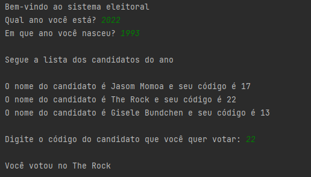

# Sistema Eleitoral

Aplicação criada com o intuito de praticar o aprendizado em Pyhton. A aplicação consiste em um algoritmo que a partir do ano de nascimento do cidadão irá identificar
se ele está apto a votar e se estiver identificar o ano de votação. Caso o ano vigente seja ano de votação, a aplicação irá apresentar os candidatos disponivéis e irá
questionar em qual candidato o cidadão irá votar.

### Configuração ###

1. Baixe a aplicação
2. Rode a aplicação em uma IDE habilitada para Pyhton, sugiro o PyCharm
3. Execute o arquivo main.py

### Resultado da aplicação ###

